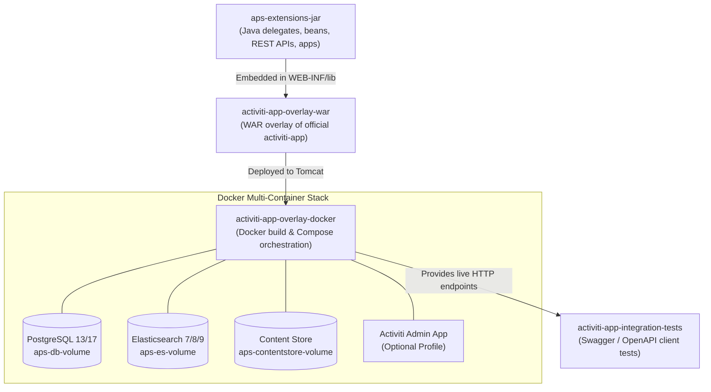

# Project Architecture & Modules

The Alfresco Process Services SDK is designed as a modular multi-module Maven project. Each module addresses a specific responsibility in the software lifecycle: developing extensions, creating WAR overlays, containerizing the runtime stack, and executing end-to-end integration tests.

---

## Architecture Overview

---

## 1. `aps-extensions-jar`

The **Extensions JAR module** contains your custom business logic and extensions to the Alfresco Process Services runtime.

* **Primary Artifact**: `aps-extensions-jar-${version}.jar`
* **Secondary Artifact**: `aps-extensions-jar-${version}-App.zip` (packaged via Maven Assembly Plugin from `apps/` directory).
* **Key Responsibilities**:
  * Implementing custom service tasks (`JavaDelegate`), task/execution listeners, and Spring components.
  * Developing custom authenticated (`/enterprise/`) and public (`/app/rest/`) REST controllers.
  * Declaring process beans, script whitelisting rules, and custom properties.
  * Executing fast unit tests using the embedded Spring test context and in-memory H2 database.

---

## 2. `activiti-app-overlay-war`

The **Activiti App Overlay WAR module** merges the official enterprise `activiti-app.war` downloaded from the Alfresco Nexus repository with your custom extensions.

* **Packaging**: `war` (via `maven-war-plugin`)
* **Key Responsibilities**:
  * Pulls the base `activiti-app` artifact matching the active APS version.
  * Embeds `aps-extensions-jar` directly into `WEB-INF/lib/`.
  * Allows customizing `WEB-INF/classes` files, including logging configurations (`log4j2.properties`, `log4j2-dev.properties`).
  * Yields a production-ready `activiti-app.war` containing all project extensions.

---

## 3. `activiti-app-overlay-docker`

The **Docker Overlay module** handles containerization and local cluster orchestration using the `io.fabric8:docker-maven-plugin`.

* **Key Responsibilities**:
  * Builds the custom `aps-sdk/alfresco-process-services` Docker container using Tomcat as the base image.
  * Dynamically generates Docker Compose files in `target/docker-compose/`:
    * `docker-compose.yml`: standard stack with APS, PostgreSQL, and Elasticsearch.
    * `docker-compose-activiti-admin.yml`: full stack including Activiti Admin application.
  * Coordinates container lifecycle: volume initialization, dependency health checks (`pg_isready`, Elasticsearch cluster health, Tomcat webapp status).
  * Automatically handles architecture differences between x86_64 and Apple Silicon (`arm64`).

---

## 4. `activiti-app-integration-tests`

The **Integration Tests module** verifies the end-to-end behavior of the deployed APS container using an automated HTTP client.

* **Key Responsibilities**:
  * Employs the official generated APS Swagger/OpenAPI Java client (`com.activiti.sdk.client.ApiClient`).
  * Authenticates as the administrator (`admin@app.activiti.com`) over port `8080`.
  * Automates runtime operations: importing app definition ZIPs, starting process instances, querying active tasks, and completing task forms with variables.
  * Validates custom REST endpoints exposed by `aps-extensions-jar`.

---

## Build Lifecycle Sequence

When executing a full build (e.g. `mvn clean install docker:build docker:start` or `./run.sh build_start`):

1. **`aps-extensions-jar`**: Compiles code, runs unit tests with embedded H2 engine, generates the extension JAR and App ZIP.
2. **`activiti-app-overlay-war`**: Extracts base `activiti-app.war`, bundles the extension JAR into `WEB-INF/lib`, and produces the overlayed WAR.
3. **`activiti-app-overlay-docker`**: Copies WAR to target context, builds Docker images using the active APS Dockerfile, provisions persistent volumes, and spins up the container stack.
4. **`activiti-app-integration-tests`**: Waits for healthchecks to pass, executes integration tests over REST APIs against the running containers.
